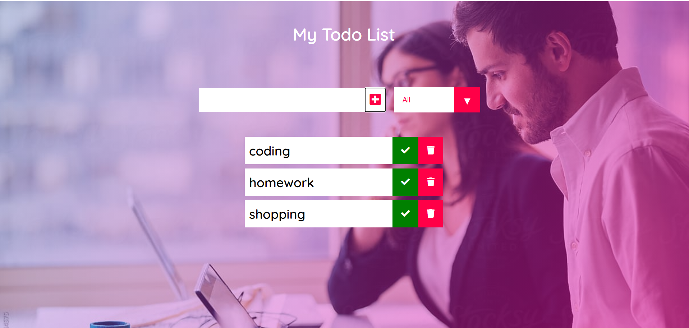

# SimpleTodoList
A simple project built using HTML,CSS, and Vanilla Javascript for maintaining todo list.  

## About
This project keeps a track of todo's and can also mark tasks that have been completed.Deletion of todo's is also present. There are filters that can be helpful in looking through a list of todo's when you want to see either your completed or incompleted tasks.On clicking the check mark that particular task gets striked off to indicate it has been completed and later can be unchecked as well.  

## Screenshots
### Basic Look

### After adding Tasks

### After marking completed Tasks

### Using Filters

